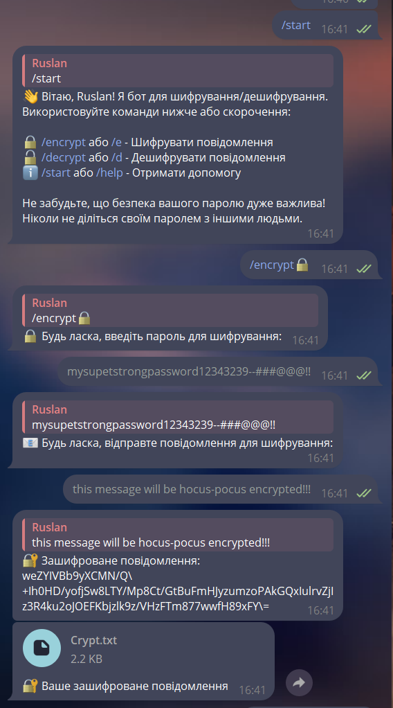
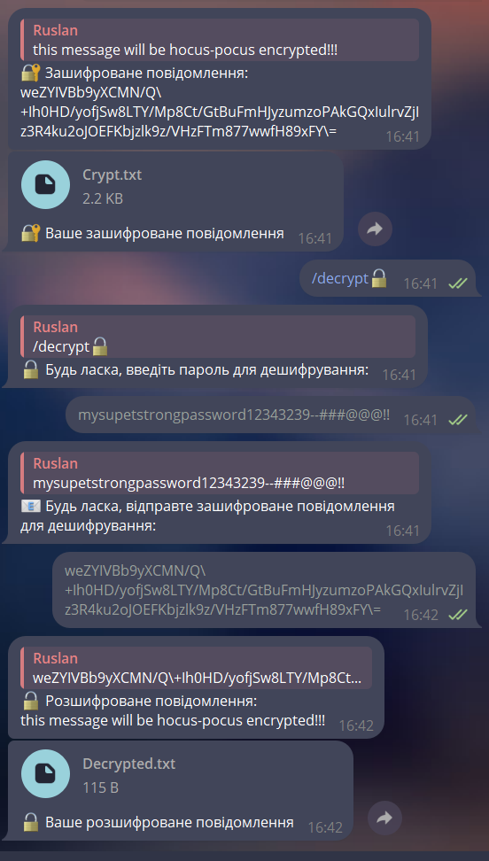

# [Cryptonit-BOT](Cryptonit-BOT)


<p align="center">
  
</p>
<p align="center">
    <h1 align="center">CRYPTONIT-BOT</h1>
</p>
<p align="center">
    <em><code>► Cryptonit-BOT is a Python-based bot designed to interact with cryptocurrency markets. This bot aims to automate trading strategies and provide users with insights and actions based on predefined rules.</code></em>
</p>
<p align="center">
	
	
	
	
<p>
<p align="center">
		<em>Developed with the software and tools below.</em>
</p>
<p align="center">
	
</p>
<hr>

## 🔗 Quick Links

> - [📍 Overview](#-overview)
> - [📦 Features](#-features)
> - [📂 Repository Structure](#-repository-structure)
> - [🧩 Modules](#-modules)
> - [🚀 Getting Started](#-getting-started)
>   - [⚙️ Installation](#️-installation)
>   - [🤖 Running Cryptonit-BOT](#-running-Cryptonit-BOT)
> - [🛠 Project Roadmap](#-project-roadmap)
> - [🤝 Contributing](#-contributing)
> - [📄 License](#-license)
> - [👏 Acknowledgments](#-acknowledgments)

---

## 📍 Overview


---

## 📦 Features
<details>
<summary>Features</summary>

  - **Environment Variable Configuration**:
  - Securely retrieves the bot token from an environment variable, ensuring sensitive data is not hard-coded in the source code.

- **Password-based Encryption and Decryption**:
  - Uses PBKDF2HMAC with SHA256 to derive encryption keys from passwords.
  - Encrypts and decrypts messages using AES in CBC mode with PKCS7 padding.

- **Secure Key and IV Generation**:
  - Generates secure random salt and initialization vectors (IV) for each encryption operation to ensure security.

- **Bot Functionality**:
  - **Start and Help Commands**:
    - Provides a welcome message and instructions for using the bot.
  - **Encrypt Command**:
    - Prompts the user for a password and the message to encrypt.
    - Returns the encrypted message and saves it to a file.
  - **Decrypt Command**:
    - Prompts the user for a password and the encrypted message.
    - Returns the decrypted message and saves it to a file.

- **File Handling**:
  - Saves encrypted and decrypted messages along with the passwords used to respective files.
  - Includes functionality to read and append additional instructions from a separate file if it exists.

- **MarkdownV2 Escape**:
  - Escapes special characters in messages to ensure proper formatting when using Telegram's MarkdownV2.

- **Custom Keyboard Creation**:
  - Provides a custom keyboard with options for encrypting, decrypting, and getting help.

- **Error Handling and Logging**:
  - Logs warnings and errors during file operations to help diagnose issues.
  - Provides user-friendly error messages in case of decryption failures.

- **File Sending**:
  - Sends the encrypted or decrypted message files back to the user as a document via Telegram.

- **User-friendly Interface**:
  - Offers a guided step-by-step interaction for encryption and decryption processes, ensuring ease of use.

</details>


---

## 📂 Repository Structure

```sh
└── Cryptonit-BOT/
    ├── Changelog.md
    ├── Instructions.txt
    ├── README.md
    ├── cryptonit.py
    ├── data
    │   ├── 1.gif
    │   ├── 2.gif
    │   ├── 4.gif
    │   ├── process.png
    │   ├── bot.png
    │   └── start.png
    └── requirements.txt
    └── LICENSE
```

---

🧩 Modules
<details>
<summary>Dependencies</summary>

    telebot
    cryptography
    base64
    uuid
    os
    logging

</details>

The project requires the following Python packages:

    [Dependencies listed in requirements.txt]
| File                                                                                        | Summary                         |
| ---                                                                                         | ---                             |
| [cryptonit.py](https://github.com/ruslanlap/Cryptonit-BOT/blob/master/cryptonit.py)         | <code>► </code> |
| [Instructions.txt](https://github.com/ruslanlap/Cryptonit-BOT/blob/master/Instructions.txt) | <code>► </code> |
| [requirements.txt](https://github.com/ruslanlap/Cryptonit-BOT/blob/master/requirements.txt) | <code>► </code> |

</details>

---

## 🚀 Getting Started

***Requirements***

Ensure you have the following dependencies installed on your system:

* **Python**: `version --last`

### ⚙️ Installation

1. Clone BOT [the Cryptonit-BOT repository]:

```sh
git clone https://github.com/ruslanlap/Cryptonit-BOT
```

2. Change to the project directory:

```sh
cd Cryptonit-BOT
```

3. Install the dependencies:
```sh
pip install -r requirements.txt
```
4. export TELEGRAM token:

```sh
export YOUR_BOT_TOKEN=<generated token here>
```

## Telegram Token Setup

Here is an additional section for the README file on how to obtain a token from Telegram:

To use Cryptonit-BOT with Telegram, you need to obtain a bot token. Follow these steps to get your token:

1. Open the Telegram app and search for the BotFather.
2. Start a chat with the BotFather by typing `/start`.
3. Create a new bot by typing `/newbot` and follow the instructions to name your bot and choose a username.
4. After successfully creating the bot, BotFather will provide you with a token.

### 🤖 Running Cryptonit-BOT
Use the following command to run Cryptonit-BOT:
```sh
python cryptonit.py
```



---

## 🛠 Project Roadmap

- [X] `► Cooming soon`
- [ ] `► add more features`
- [ ] `► ...`

---

## 🤝 Contributing

Contributions are welcome! Here are several ways you can contribute:

- **[Submit Pull Requests](https://github.com/ruslanlap/Cryptonit-BOT/blob/main/CONTRIBUTING.md)**: Review open PRs, and submit your own PRs.
- **[Join the Discussions](https://github.com/ruslanlap/Cryptonit-BOT/discussions)**: Share your insights, provide feedback, or ask questions.
- **[Report Issues](https://github.com/ruslanlap/Cryptonit-BOT/issues)**: Submit bugs found or log feature requests for Cryptonit-bot.

<details closed>
    <summary>Contributing Guidelines</summary>

1. **Fork the Repository**: Start by forking the project repository to your GitHub account.
2. **Clone Locally**: Clone the forked repository to your local machine using a Git client.
   ```sh
   git clone https://github.com/ruslanlap/Cryptonit-BOT
   ```
3. **Create a New Branch**: Always work on a new branch, giving it a descriptive name.
   ```sh
   git checkout -b new-feature-x
   ```
4. **Make Your Changes**: Develop and test your changes locally.
5. **Commit Your Changes**: Commit with a clear message describing your updates.
   ```sh
   git commit -m 'Implemented new feature x.'
   ```
6. **Push to GitHub**: Push the changes to your forked repository.
   ```sh
   git push origin new-feature-x
   ```
7. **Submit a Pull Request**: Create a PR against the original project repository. Clearly describe the changes and their motivations.

Once your PR is reviewed and approved, it will be merged into the main branch.

</details>

---

## 📄 License

This project is protected under the [MIT LICENSE](https://choosealicense.com/licenses) License. For more details, refer to the [LICENSE](https://raw.githubusercontent.com/ruslanlap/Cryptonit-BOT/master/LICENSE) file.

---

## 👏 Acknowledgments

- List any resources, contributors, inspiration, etc. here.

[**Return**](#-quick-links)

---